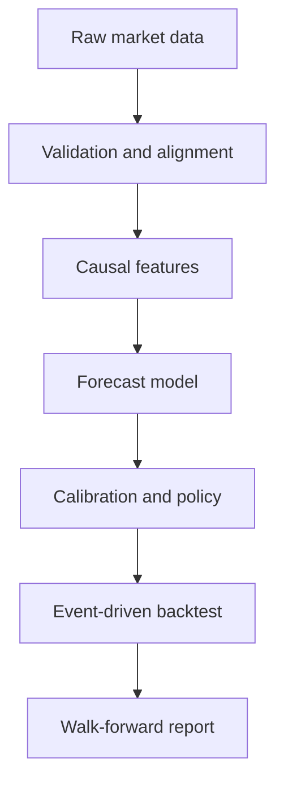

# Architecture

状态：**Normative target / 尚未完整实现**

## 设计目标

v1 架构必须保证同一份策略配置贯穿数据、Ground Truth、模型、回测和 paper trading，并使每个研究结论都能够追溯到确定的数据版本、代码版本和配置。



## 单一配置来源

所有核心模块必须接收同一个 `StrategySpec`，至少包含：

- base interval 与 decision interval；
- feature cutoff 与 entry delay；
- forecast horizons；
- maximum holding period；
- TP/SL 或 action-value 规则；
- fee、spread、slippage、funding；
- leverage cap、risk budget 和 position limits；
- ambiguous-bar 与 fold-end 处理。

禁止 target、backtest 和 live 分别维护三套含义相近但数值不同的配置。

## 目标目录

```text
configs/
  strategy_15m.yaml
  data.yaml
  experiments/
src/pretimesequence/
  data/
    fetch.py
    schema.py
    validation.py
    storage.py
  features/
    price.py
    volume.py
    microstructure.py
    context.py
  targets/
    returns.py
    path.py
    action_values.py
  validation/
    splits.py
    walk_forward.py
    calibration.py
  models/
    baselines.py
    forecast.py
    meta_filter.py
  policy/
    decision.py
    sizing.py
    risk.py
  backtest/
    engine.py
    execution.py
    account.py
    metrics.py
  live/
    feed.py
    broker.py
    state.py
    safeguards.py
tests/
scripts/
docs/
```

在 v1 完成前，现有 `pretimesequence/` 继续作为 v0 保留，不应通过简单移动文件伪装为已完成重构。

## 模块边界

### Data

负责获取、存储、校验和对齐；不生成标签，不包含策略判断。

### Features

只使用 bar `t` close 及以前可见的数据。任何模型生成特征必须来自 chronological OOF 预测。

### Targets

只描述未来路径和单单位名义本金下的 action outcome，不决定账户杠杆和实际仓位。

### Models

输出收益、路径概率、action value 或校准概率；不得直接读取账户未来状态。

### Policy and Risk

把预测转换为 long/short/flat，并根据风险预算计算仓位。模型置信度不能直接等同于仓位。

### Backtest

逐事件维护订单、持仓、保证金和账户权益，是唯一可以计算策略收益的模块。

## 主要数据契约

| Artifact | 必要内容 |
| --- | --- |
| Dataset manifest | symbol、venue、contract、time range、timezone、schema、checksum |
| Feature matrix | timestamp、feature version、严格因果的特征列 |
| Target table | entry timestamp、horizon、future return、MFE、MAE、action outcomes |
| Model manifest | data/config/code version、feature list、train range、calibration |
| Backtest report | StrategySpec、fold、成本、交易、权益曲线、风险指标 |

## 失败方式

系统应 fail fast：

- 模型或 feature schema 不匹配时立即报错；
- 时间戳未排序、重复或存在异常缺口时拒绝训练；
- 缺少成本参数时拒绝交易回测；
- outer test 被用于调参时将实验标记为 invalid；
- 不允许静默退化为动量模型或默认参数。

