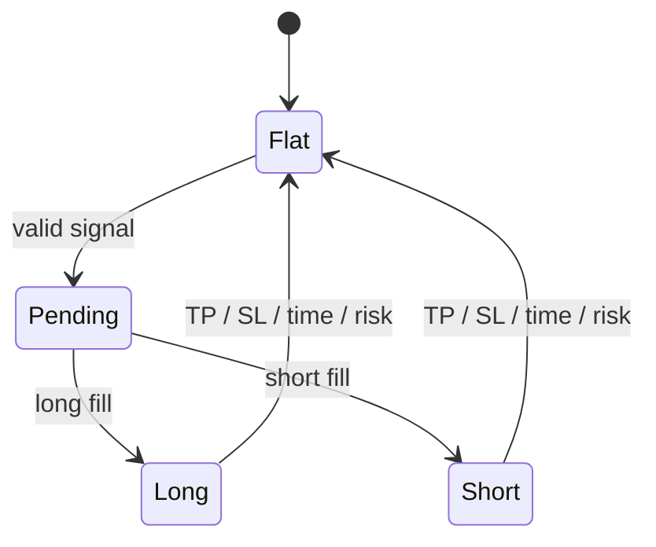

# Ground Truth, Validation and Backtesting

状态：**Normative target**

## 1. Ground Truth 原则

Ground Truth 应描述未来真实价格路径及不同动作的结果，而不是把杠杆、账户规模和事后最优方向混成一个标签。

设信号在 bar `t` close 形成，默认入场价为下一可成交时点 `entry(t+1)`。

主要 target：

```text
return_h = log(close[t+h] / entry[t+1])
MFE_h    = max(high[t+1:t+h] / entry[t+1] - 1)
MAE_h    = min(low[t+1:t+h] / entry[t+1] - 1)
```

对 long/short 分别计算：

- TP 是否先于 SL；
- first-hit time；
- 扣除 spread、slippage、fee 后的单位名义本金净收益；
- horizon 结束时的净收益；
- ambiguous-bar 标记。

基础 target 不乘账户杠杆。杠杆和 margin 在 policy/backtest 层计算。

## 2. 推荐建模目标

优先采用多输出或多任务预测：

1. future return quantiles；
2. MFE/MAE regression；
3. `P(long TP before SL)`；
4. `P(short TP before SL)`；
5. `E[pnl_long]` 与 `E[pnl_short]`；
6. forecast uncertainty。

flat 由 action value 和置信度门槛产生。若保留分类标签，必须设置 neutral/ambiguous 区域，禁止把多空收益相同的样本默认归为 long。

## 3. 标签歧义

同一 1m bar 同时触及 TP 和 SL 时无法从 OHLC 判断盘中顺序。允许的处理方式：

- 使用秒级或逐笔数据恢复顺序；
- 保守地按不利方向处理；
- 标记为 ambiguous 并从主训练集排除；
- 对不同假设做敏感性分析。

不得按代码检查顺序无说明地决定结果。

## 4. 时间切分

### Outer evaluation

使用 rolling 或 expanding walk-forward：

```text
train -> calibration/validation -> purge/embargo -> outer test
```

outer test 只用于最终评估，不能选择 feature、horizon、阈值或模型。

### Purge and embargo

- purge 长度至少覆盖最大 target horizon；
- embargo 覆盖执行延迟和可能的标签重叠；
- feature lookback 不造成未来泄漏，但必须保证初始化窗口完整；
- 每分钟一个 15 分钟标签会高度重叠，应比较降频决策或 uniqueness weighting。

### OOF stacking

独立 forecast model 的输出只有在 chronological OOF 生成后，才能作为 meta model 输入。禁止在同一训练样本上训练 forecast model 并使用其 in-sample prediction。

## 5. 概率校准与阈值

- calibration 只能使用训练窗口内独立验证段；
- 比较 Platt、isotonic 或其他适当方法；
- 报告 reliability curve、Brier score 和分箱命中率；
- 交易阈值只能在 inner validation 选择；
- outer test 必须同时报告所有预注册阈值或冻结阈值。

## 6. 回测状态机



引擎必须逐 bar/event 更新状态。TP/SL 后持仓立即恢复 flat；下一次开仓依据真实账户状态，而不是预先计算的虚拟 position。

回测至少模拟：

- next-bar fill；
- bid/ask、spread、slippage；
- maker/taker fee；
- funding；
- min notional、tick size、step size；
- maintenance margin 和 liquidation；
- fold-end forced close；
- 数据缺口与异常行情；
- 单 symbol 单持仓约束。

## 7. 评价指标

### Forecast

- MAE/RMSE 或 quantile loss；
- PR-AUC/ROC-AUC，仅作为辅助；
- Brier score 与 calibration；
- selected-trade precision；
- regime 与 symbol 分层表现。

### Trading

- net return after costs；
- median/worst fold；
- maximum drawdown 与 time under water；
- profit factor、win/loss ratio、expectancy；
- turnover 与交易次数；
- downside deviation、CVaR；
- consecutive losses 与 probability of ruin；
- 参数和成本敏感性。

balanced accuracy 不能作为主要上线指标。

## 8. 基线

每个 outer fold 必须同时运行：

- always flat；
- matched-turnover random；
- 15m momentum；
- 15m mean reversion；
- breakout；
- logistic/linear model；
- XGBoost baseline。

复杂模型只有在多个 fold、币种和成本假设下稳定优于这些基线才有意义。

## 9. Paper trading 门槛

进入 paper trading 前必须：

1. 通过泄漏检查和关键时序测试；
2. outer walk-forward 保守成本后具有正的中位数期望；
3. 最差 fold 风险处于预设预算；
4. 结果不依赖一个币种、一个周或一个阈值；
5. 冻结 holdout 为正且未参与调参；
6. 参数附近不存在明显性能断崖；
7. 模型、特征、配置和数据版本可完整追溯。

